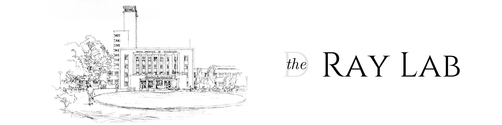

<!-- # The Ray Research Group -->
<!-- # Research -->

  

<!-- Our curiousity-driven research group bridges fluid dynamics, machine learning, and systems biology. We develop new theory and algorithms for analysis and control of chaotic systems---ranging from turbulent puffs to neural spikes---and collaborate to apply these tools broadly. One part of the lab develops novel machine learning algorithms for time series, drawing upon the classical physics of complex systems such as strange attractors, cellular automata, and random graphs. The second part of the group applies these principles to real-world complex systems such as biological measurements and fluid mixing.
 -->
<!-- Check out our [gallery](pages/gallery.html) -->

## Members

Prof. Debashis Ray\
Professor & Head, Department of Chemistry\
Indian Institute of Technology Kharagpur\
[[Web]](http://www.iitkgp.ac.in/department/CY/faculty/cy-dray) [[Email]](mailto:dray@chem.iitkgp.ac.in)

### PhD Students

- Biswarup Dutta, _2018-present_

### [Alumni](alumni.md)

## Recent Publications

- Bhanja, A.; Herchel, R.; Moreno-Pineda, E.; Khara, A.; Wernsdorfer, W.; Ray, D.\
Synthesis, Characterization, Magnetism and Theoretical Analysis of Hetero-Metallic [Ni2Ln2] Partial Di-Cubane Assemblies.\
_Dalton Transactions, 2021, 50, 12517–12527._ [[DOI]](https://doi.org/10.1039/d1dt00510c)

- Bhanja, A.; Smythe, L.; Kotrle, K.; Ortu, F.; Herchel, R.; Murrie, M.; Ray, D.\
Synthesis of Heptanuclear Ni4Dy3 Coordination Aggregate Using Tridentate Ligand: X-Ray Structure, Magnetism and Theoretical Studies.\
_Inorganica Chimica Acta, 2021, 526, 120524._ [[DOI]](https://doi.org/10.1016/j.ica.2021.120524)

- Basak, D.; Smythe, L.; Herchel, R.; Murrie, M.; Nemec, I.; Ray, D.\
From Tetranuclear to Pentanuclear [Co–Ln] (Ln = Gd, Tb, Dy, Ho) Complexes across the Lanthanide Series: Effect of Varying Sequence of Ligand Addition.\
_Dalton Transactions, 2021, 50, 11861–11877_. [[DOI]](https://doi.org/10.1039/d1dt02038b)

- Biswas, M.; Sañudo, E. C.; Ray, D.\
Carboxylate-Decorated Aggregation of Octanuclear Co4Ln4 (Ln = Dy, Ho, Yb) Complexes from Ligand-Controlled Hydrolysis: Synthesis, Structures, and Magnetic Properties.\
_Inorganic Chemistry, 2021, 60, 11129–11139._ [[DOI]](https://doi.org/10.1021/acs.inorgchem.1c01070)

- Basak, D.; Martí, E. R.; Murrie, M.; Nemec, I.; Ray, D.\
Solvent-Induced Structural Transformation from Heptanuclear to Decanuclear [Co–Ln] Coordination Clusters: Trapping of Unique Counteranion and Understanding of Aggregation Pathways.\
_Dalton Transactions, 2021, 50, 9574–9588._ [[DOI]](https://doi.org/10.1039/d1dt01278a)

## Join

**Postdocs.** Please email Prof. Ray directly. Please include a CV or resume and a few sentences explaining which area of the lab’s research you are interested in (or if you want to explore a new area). Applicants from diverse backgrounds are welcome!

**PhD Students.** If you have not yet applied, please apply to the Department of Chemistry.
If you are already at IIT Kharagpur, please email Prof. Ray.

## Contact
115, Department of Chemistry,\
Indian Institute of Technology,\
Kharagpur\
721 302, WB, INDIA

Office: +91-3222-283324

 
 ## Map
 
<iframe width='55%' height='300px' align="left" src="https://api.mapbox.com/styles/v1/wrik/ckvqkpuhg20az14quehyfdasy.html?title=false&access_token=pk.eyJ1Ijoid3JpayIsImEiOiJja3Zxa282NHExbHVyMzNxZmpxYTRnOHhjIn0.Hqwka43658V3y1S0raWnSw&zoomwheel=false#16.93/22.319388/87.311138/260.8/56" title="Streets" style="border:none;"></iframe>

## 

